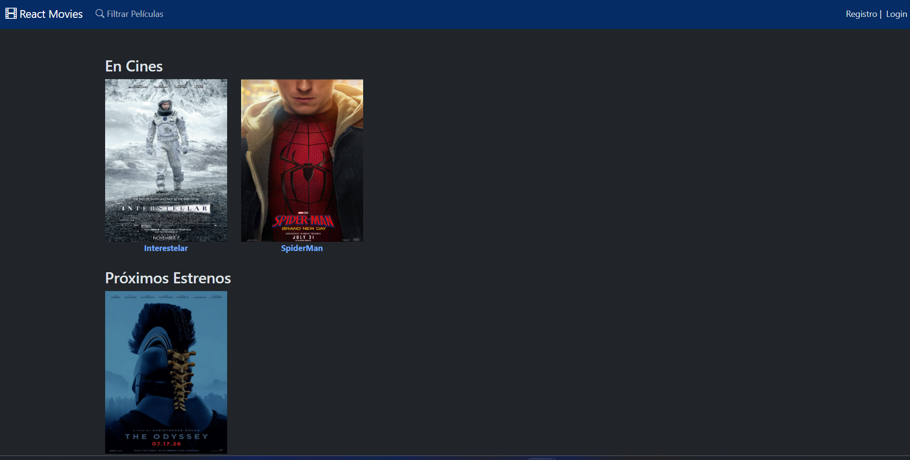
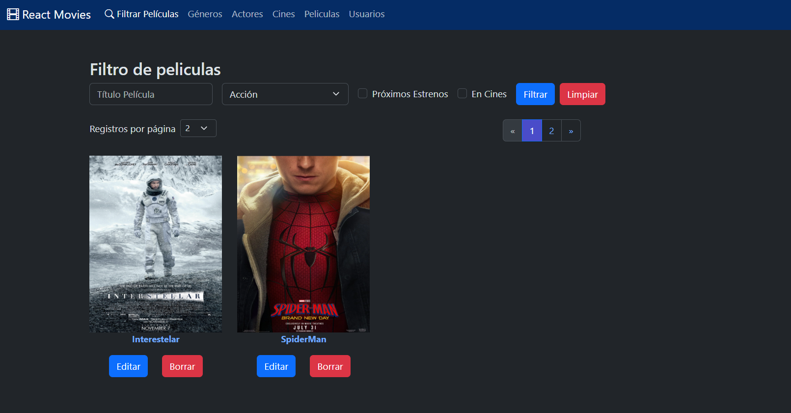
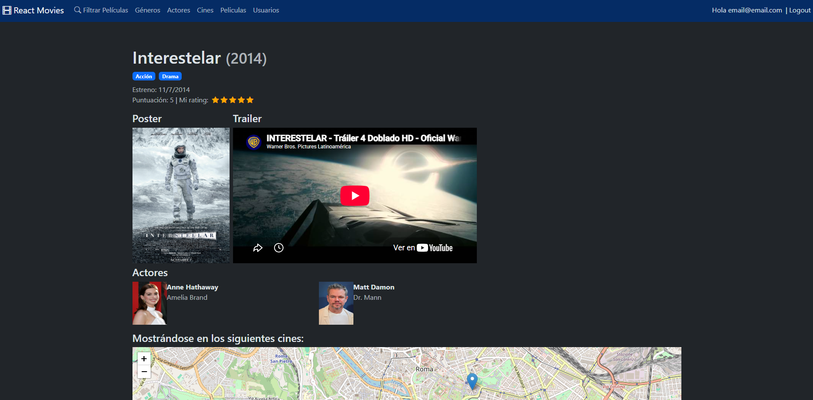
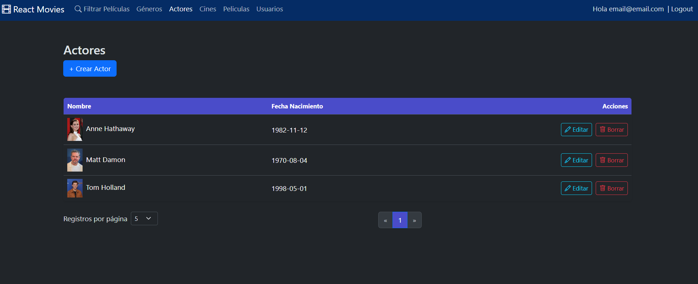

🇪🇸 Español&nbsp;|&nbsp;🇬🇧 [English](README.en.md)

# 🎬 Movies — Cliente React

Aplicación de una sola página (SPA) construida con **React 19**, **TypeScript** y **Vite**, que consume la [Movies API](https://github.com/iliana212/API_Movies) (ASP.NET Core / .NET 10). Permite explorar y filtrar películas, calificarlas, y administrar géneros, actores, cines y películas con control de acceso por rol.

Existe también una versión de este cliente en Angular: [Angular_Movies](https://github.com/iliana212/Angular_Movies).

   

> **Estado:** en desarrollo activo.

   

## En un vistazo

- **Página de inicio** con películas en cines y próximos estrenos
- **Filtro de películas** por título, género, en cines y próximos estrenos, con paginación
- **Detalle de película** con calificación por parte de usuarios autenticados
- **Autenticación JWT**: registro e inicio de sesión, token con control de expiración y un interceptor de Axios que lo adjunta a cada petición
- **Rutas protegidas por claim** (`esadmin`) para la administración de géneros, actores, cines y películas
- CRUD completo con formularios validados, **carga de imágenes**, autocompletado de actores y **mapa interactivo** para ubicar los cines
- Componentes genéricos reutilizables (listados, paginación, selector múltiple, manejo de errores)

## Tecnologías

| Área | Tecnología |
| --- | --- |
| UI | React 19, TypeScript 5.8 |
| Build | Vite 6 (SWC) |
| Rutas | React Router 7 |
| Formularios | React Hook Form, Yup |
| HTTP | Axios (con interceptor JWT) |
| Mapas | Leaflet, React-Leaflet |
| Autocompletado | react-bootstrap-typeahead |
| Estilos | Bootstrap 5, Bootstrap Icons |
| Alertas | SweetAlert2 |
| Calidad | ESLint 9 |

## Estructura del proyecto

```
src/
├── api/            # Cliente Axios (baseURL + interceptor JWT)
├── componentes/    # Componentes compartidos (Mapa, Rating, Paginación, SelectorMultiple…)
├── features/       # Módulos por dominio
│   ├── actores/
│   ├── cines/
│   ├── generos/
│   ├── peliculas/
│   ├── seguridad/  # Login, registro, rutas protegidas, manejo del JWT
│   └── home/
├── hooks/          # Hooks reutilizables (useEntidades)
├── utilidades/     # Alertas, confirmaciones, manejo de errores, fechas
└── validaciones/   # Validaciones con Yup
```

## Cómo ejecutarlo

### Requisitos

- Una versión LTS actual de [Node.js](https://nodejs.org/) (20.19+ o 22.12+)
- La [Movies API](https://github.com/iliana212/API_Movies) en ejecución (sigue las instrucciones de su README)

### Instalación

```bash
git clone https://github.com/iliana212/React_Movies.git
cd React_Movies
npm install
```

### Configurar la URL de la API

Crea un archivo `.env` en la raíz del proyecto con la URL base de la API (incluyendo `/api`):

```bash
VITE_API_URL=https://localhost:7263/api
```

> La API solo acepta peticiones de los orígenes permitidos. Asegúrate de que `http://localhost:5173` (el puerto por defecto de Vite) esté en `origenesPermitidos` en la configuración de la API.

### Ejecutar en desarrollo

```bash
npm run dev
```

La aplicación estará disponible en `http://localhost:5173`.

## Scripts disponibles

| Script | Descripción |
| --- | --- |
| `npm run dev` | Inicia el servidor de desarrollo de Vite |
| `npm run build` | Verifica los tipos con TypeScript y genera el build de producción |
| `npm run preview` | Previsualiza el build de producción |
| `npm run lint` | Ejecuta ESLint |

## Proyectos relacionados

| Proyecto | Descripción |
| --- | --- |
| [API_Movies](https://github.com/iliana212/API_Movies) | Web API en ASP.NET Core (backend) |
| [Angular_Movies](https://github.com/iliana212/Angular_Movies) | Cliente en Angular |

## Autora

**Iliana Barron** — [@iliana212](https://github.com/iliana212)
